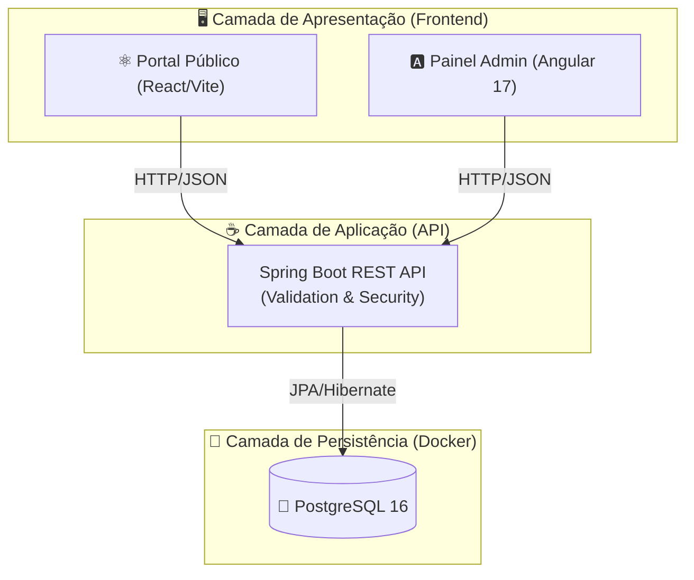

# 🚀 TechEvents - Plataforma de Gestão de Eventos Full Stack


> **Desenvolvido por [Filipi Moraes](https://www.linkedin.com/in/filipimoraes/)**
> *Engenheiro de Software | Java Full Stack Specialist*

---

## 🎯 Visão do Produto (Product Vision)

**TechEvents** é uma solução corporativa *End-to-End* para gestão de eventos tecnológicos. Projetada para alta escalabilidade, a plataforma resolve o problema de desconexão entre a área pública (vendas) e a área administrativa (gestão).

O diferencial técnico é a implementação de um ecossistema de microsserviços simulado, onde múltiplas interfaces (React e Angular) consomem uma API Centralizada e Dockerizada.

---

## 🏗️ Arquitetura da Solução

A arquitetura foi desenhada seguindo princípios de **Clean Architecture** e **12-Factor App**, garantindo que o Frontend seja agnóstico ao Backend e que a infraestrutura seja efêmera (Docker).

### Fluxo de Dados (Data Flow)



## 📂 Estrutura de Código (Project Structure)

Organização baseada em domínios para facilitar manutenção e testes:

```bash
TechEvents/
├── 🐳 docker-compose.yml       # Orquestração da Infraestrutura (BD)
├── ☕ src/                     # Código Fonte Backend (Spring Boot)
│   ├── main/java/com/techevents/
│   │   ├── domain/             # Regras de Negócio (Entities)
│   │   ├── api/                # Controllers & DTOs (Validation)
│   │   ├── service/            # Lógica de Aplicação
│   │   └── infra/              # Configurações (Cors, Swagger, ExceptionHandler)
│   └── test/                   # Testes Unitários (JUnit 5)
├── 📜 pom.xml                  # Dependências Maven
├── ⚛️ frontend-public/         # Portal React (User Experience)
│   ├── src/components/         # UI Components (Cards, Navbar)
│   └── src/services/           # Integração com API
└── 🅰️ frontend-admin/          # Dashboard Angular (Backoffice)
    ├── src/app/pages/          # Módulos (Dashboard, Events)
    └── src/app/interceptors/   # Tratamento Global de Erros
```

## ✨ Diferenciais de Engenharia (Elite Features)

Este projeto implementa padrões exigidos em grandes corporações:

### 🛡️ Backend (Java 21 + Spring Boot)
*   **Documentation First:** API 100% documentada via OpenAPI (Swagger UI).
*   **Data Shielding:** Uso rigoroso de Bean Validation (`@NotNull`, `@Size`) para impedir "Lixo" no banco de dados.
*   **Resilience:** Tratamento global de erros (`@ControllerAdvice`), transformando StackTraces em mensagens JSON amigáveis (RFC 7807).
*   **Testing:** Cobertura de testes unitários no Service Layer com Mockito.

### 🎨 Frontend (React & Angular)
*   **Design System:** Interfaces consistentes inspiradas no padrão SaaS (Luma/Eventbrite).
*   **Feedback Loop:** O usuário sempre sabe o status da ação (Toasts de Sucesso, Spinners de Loading, Snackbars de Erro).
*   **Interceptor Pattern (Angular):** Captura automática de requisições HTTP para gerenciar Loaders globais.
*   **Mobile-First:** Layouts responsivos que se adaptam de Smartphones a Desktops.

### 🔄 DevOps & Automação
*   **CI/CD Pipeline:** Workflow do GitHub Actions configurado. A cada push na main, o sistema roda automaticamente o build e os testes unitários para garantir qualidade.

---

## 📸 Galeria do Projeto

### 📚 Documentação Viva (Swagger UI)
Acesse `/swagger-ui.html` para testar os endpoints interativamente.

### 🖥️ Dashboard Administrativo (Angular)
Gestão de eventos com feedback visual e métricas.

### 🌐 Portal de Eventos (React)
Interface pública focada na experiência do usuário.

---

## 🚀 Como Executar (Getting Started)

### Pré-requisitos
*   Docker & Docker Compose
*   Java JDK 21
*   Node.js 20+

### Passo 1: Infraestrutura
```bash
docker compose up -d
```

### Passo 2: Backend
```bash
mvn spring-boot:run
```
*   **API:** `http://localhost:8080`
*   **Swagger:** `http://localhost:8080/swagger-ui.html`

### Passo 3: Frontends

**Portal Público:**
```bash
cd frontend-public && npm run dev
```

**Painel Admin:**
```bash
cd frontend-admin && npm start
```

---

## 👨‍💻 Autor


**Filipi Moraes**
*Software Engineer | Full Stack Java Specialist*
