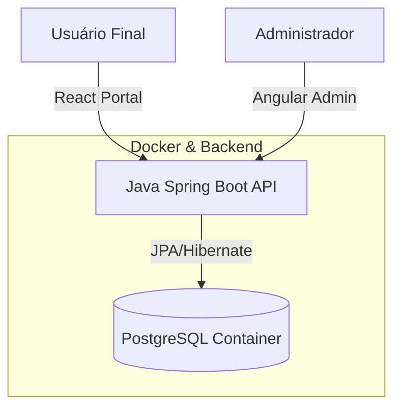

# 🚀 TechEvents - Plataforma de Eventos Full Stack (Dockerized)


## 📋 Sobre o Projeto

O **TechEvents** é uma solução completa para gestão de eventos, projetada para demonstrar **Arquitetura de Software Sênior**.

O sistema implementa uma **Clean Architecture** no Backend, persistência robusta com **PostgreSQL via Docker**, e serve duas interfaces distintas simultaneamente:
1.  **Backoffice (Angular):** Painel administrativo para gestão de dados.
2.  **Portal Público (React):** Interface de alta performance para o usuário final.

---

## 🏗️ Arquitetura e Infraestrutura

O projeto foi evoluído de um banco em memória para uma infraestrutura containerizada, garantindo persistência e consistência de dados.



### 🛠️ Tech Stack
*   **Core:** Java 21, Spring Boot 3
*   **Database:** PostgreSQL 16 (Imagem Alpine rodando no Docker)
*   **Admin Frontend:** Angular + Material Design
*   **Public Frontend:** React + Tailwind CSS
*   **DevOps:** Docker Compose para orquestração de ambiente

---

## 🚀 Como Rodar o Projeto (Setup Profissional)

### Pré-requisitos
*   Docker Desktop instalado e rodando.
*   Java 21 e Maven.
*   Node.js.

### 1️⃣ Subindo a Infraestrutura (Banco de Dados)
Não é necessário instalar o PostgreSQL na sua máquina. O Docker resolve tudo. Na raiz do projeto, execute:

```bash
docker compose up -d
# Isso baixará a imagem do Postgres e iniciará o banco na porta 5432.
```

### 2️⃣ Rodando o Backend (API)

```bash
# Na raiz do projeto (onde está o pom.xml)
mvn clean spring-boot:run
# O sistema conectará automaticamente ao Docker e criará as tabelas.
# API disponível em: http://localhost:8080
```

### 3️⃣ Rodando os Frontends

**Admin (Angular):**

```bash
cd frontend-admin
npm start
# Acesso: http://localhost:4200
```

**Portal (React):**

```bash
cd frontend-public
npm run dev
# Acesso: http://localhost:5173
```

---

## 🧠 Diferenciais Técnicos Implementados
*   **Persistência Real:** Migração de H2 para PostgreSQL para garantir integridade de dados.
*   **Containerização:** Uso de Docker Compose para setup de ambiente em um comando.
*   **CORS Strategy:** Configuração de segurança para permitir múltiplos clientes (Angular/React).
*   **Clean Code:** Separação clara de responsabilidades (Domain, Infrastructure, Application).

---

## 👨‍💻 Autor
Desenvolvido por **Filipi Moraes**
Engenharia de Software | Java Full Stack
